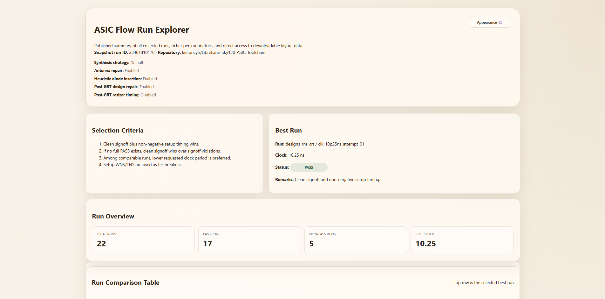
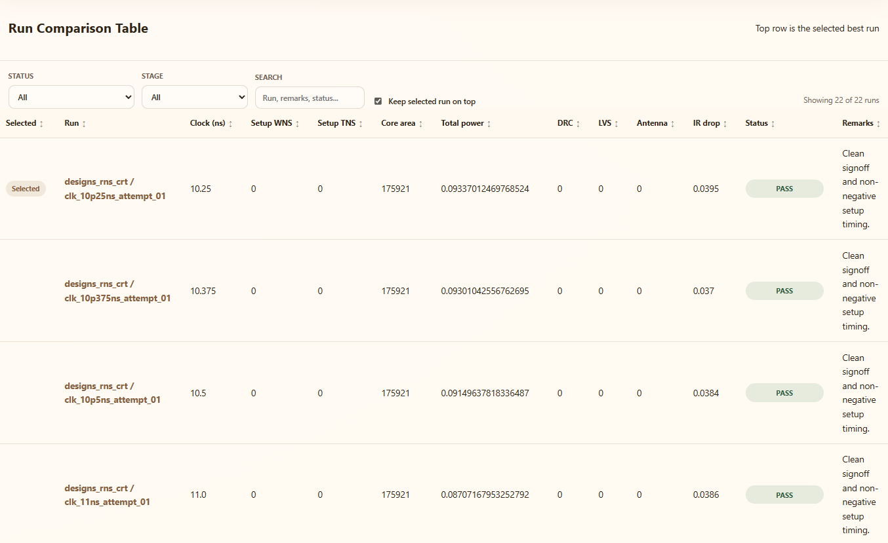
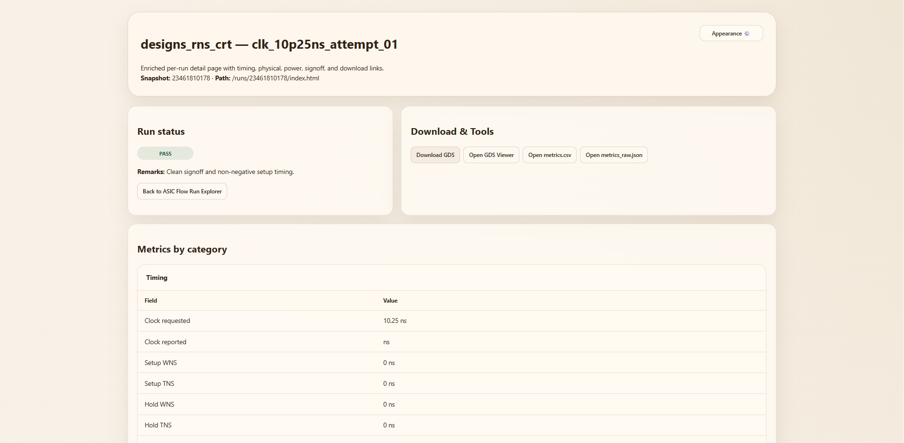

# LibreLane-Sky130-ASIC-Toolchain

A variant-driven GitHub ASIC flow and Run Explorer for **Sky130 + OpenLane2 / LibreLane**.

This repository is built around **named design variants** and the CI flow handles the timing sweeps, comparison, and publishing.

---

## What Is This?

`LibreLane-Sky130-ASIC-Toolchain` is a GitHub-based workflow for running ASIC experiments in a clean, repeatable way, built around **named design variants**.

Each design lives in its own folder under `designs/<variant_name>/`, has its own `variant.yaml`, and is selected through `manifest.yaml`.

From there, the CI runs the following:

- Staged **OpenLane2 / LibreLane timing sweeps**
- Comparisons of the generated runs
- Publishes a lightweight **Run Explorer** through GitHub Pages

---

## TL:DR

The normal user workflow is:

1. Put your ASIC RTL into `designs/<variant_name>/src/`
2. Fill in `variant.yaml`
3. Select the active design in `manifest.yaml`
4. Push to GitHub
5. Let CI do the rest
6. Open the Run Explorer and inspect the results

That is the whole philosophy of the repo.

---

## Quick Start Guide

### 1. Clone the Repository

```bash
git clone https://github.com/kierancyh/LibreLane-Sky130-ASIC-Toolchain.git
cd LibreLane-Sky130-ASIC-Toolchain
```

### 2. Create or Edit a Design Variant

Make a design folder under `designs/`.

Example:

```text
designs/my_variant/
├─ variant.yaml
└─ src/
   ├─ my_top.v
   └─ ...
```

### 3. Put your Files in the Right Place

- Place your synthesizable RTL in `src/`

### 4. Fill in `variant.yaml`

A typical variant looks like this:

```yaml
name: my_variant
pdk: sky130A

top_module: my_top

clock:
  port: clk
  mode: auto
  max_ns_cap: 200

sources:
  - src/**/*.v
```

### 5. Select the Active Variant in `manifest.yaml`

Example:

```yaml
project:
  title: "LibreLane Sky130 ASIC Toolchain"
  author: "Kieran"
  notes: "Variant-driven Sky130/OpenLane2 research workflow"

experiments:
  - variant: designs/my_variant
    enabled: true
```

### 6. Push Your Changes

The normal usage model is simply:

```bash
git add .
git commit -m "Add or update design variant"
git push
```

Once pushed, GitHub Actions will run the flow.

---

## What CI does for you

At a high level, the flow resolves the active variant, performs staged timing sweeps, compares the collected runs, and publishes the Run Explorer.

---

## How to use the Run Explorer

After CI completes, open the published Run Explorer from the workflow summary or the GitHub Pages deployment.

The homepage is designed to answer the big questions quickly:

- Which runs passed?
- Which ones failed timing?
- Which ones failed signoff?
- Which run looks best overall?
- Which artifacts are available?

The per-run pages give you more detail, including grouped metrics and useful output links.

---

## Viewing your GDS

This repo does **not** use the Tiny Tapeout harden flow.
It only uses the external Tiny Tapeout viewer as a convenient way to inspect a generated GDS in the browser.

### External GDS viewer

- **Tiny Tapeout GDS Viewer:** <https://gds-viewer.tinytapeout.com/>

### How to use it

1. Download the GDS from the run page or artifact
2. Open the Tiny Tapeout GDS Viewer
3. Drag and drop the GDS file into the page
4. Use the viewer controls to inspect geometry and hierarchy

If the Run Explorer shows a **Viewer** button for GDS, that is the quickest route.

---

## Further Reading

For the full technical explanation of the workflow, architecture, artifact model, and timing refinement logic, see:

- [`TECHNICAL DOCUMENTATION.md`](./TECHNICAL%20DOCUMENTATION.md)

---

## Explorer Preview (Screenshots)

### 1. Run Explorer Homepage
A high-level summary of the selected run, including the chosen best result, key metrics, and quick access to GDS viewing tools.



---

### 2. Run Comparison Table
The comparison view for all generated runs, showing timing, area, power, IR drop, status, remarks, and GDS actions in one place.



---

### 3. Per-Run Page
The detailed page for a single run, including grouped metadata, stage information, metrics, downloads, and run-specific outputs.



---
